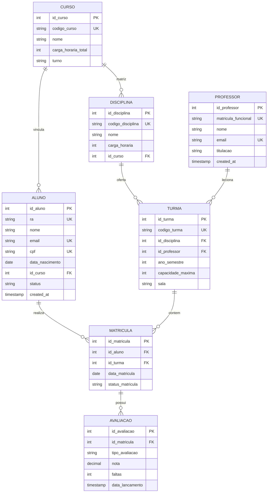

# 🗄️ Modelo de Banco de Dados — Sistema Acadêmico Universitário (SEI-Uni)

> **Módulo:** Banco de Dados (Responsáveis: João Paulo e Rubens Cosmo)  
> **Disciplina:** Gerência de Configuração (ESW432)  
> **Versão:** 1.0.0  
> **Identificador de ICS:** `ICS-BD-SCHEMA-001`

---

## 1. Visão Geral

Este documento descreve o modelo relacional inicial do banco de dados do **Sistema Acadêmico Universitário**. O objetivo é armazenar e gerenciar informações cadastrais de alunos, professores, cursos, disciplinas, turmas, matrículas e avaliações acadêmicas.

---

## 2. Diagrama Entidade-Relacionamento (ER)



---

## 3. Dicionário de Dados e Definição das Tabelas (DDL)

```sql
-- =======================================================
-- 1. TABELA: CURSOS
-- =======================================================
CREATE TABLE cursos (
    id_curso SERIAL PRIMARY KEY,
    codigo_curso VARCHAR(10) UNIQUE NOT NULL,
    nome VARCHAR(100) NOT NULL,
    carga_horaria_total INT NOT NULL,
    turno VARCHAR(20) CHECK (turno IN ('MATUTINO', 'VESPERTINO', 'NOTURNO', 'INTEGRAL')),
    created_at TIMESTAMP DEFAULT CURRENT_TIMESTAMP
);

-- =======================================================
-- 2. TABELA: PROFESSORES
-- =======================================================
CREATE TABLE professores (
    id_professor SERIAL PRIMARY KEY,
    matricula_funcional VARCHAR(20) UNIQUE NOT NULL,
    nome VARCHAR(150) NOT NULL,
    email VARCHAR(100) UNIQUE NOT NULL,
    titulacao VARCHAR(50) DEFAULT 'MESTRE',
    created_at TIMESTAMP DEFAULT CURRENT_TIMESTAMP
);

-- =======================================================
-- 3. TABELA: ALUNOS
-- =======================================================
CREATE TABLE alunos (
    id_aluno SERIAL PRIMARY KEY,
    ra VARCHAR(20) UNIQUE NOT NULL,
    nome VARCHAR(150) NOT NULL,
    email VARCHAR(100) UNIQUE NOT NULL,
    cpf VARCHAR(14) UNIQUE NOT NULL,
    data_nascimento DATE NOT NULL,
    id_curso INT NOT NULL,
    status VARCHAR(20) DEFAULT 'ATIVO' CHECK (status IN ('ATIVO', 'TRANCADO', 'FORMADO', 'DESISTENTE')),
    created_at TIMESTAMP DEFAULT CURRENT_TIMESTAMP,
    CONSTRAINT fk_aluno_curso FOREIGN KEY (id_curso) REFERENCES cursos(id_curso)
);

-- =======================================================
-- 4. TABELA: DISCIPLINAS
-- =======================================================
CREATE TABLE disciplinas (
    id_disciplina SERIAL PRIMARY KEY,
    codigo_disciplina VARCHAR(15) UNIQUE NOT NULL,
    nome VARCHAR(100) NOT NULL,
    carga_horaria INT NOT NULL,
    id_curso INT NOT NULL,
    CONSTRAINT fk_disciplina_curso FOREIGN KEY (id_curso) REFERENCES cursos(id_curso)
);

-- =======================================================
-- 5. TABELA: TURMAS
-- =======================================================
CREATE TABLE turmas (
    id_turma SERIAL PRIMARY KEY,
    codigo_turma VARCHAR(20) UNIQUE NOT NULL,
    id_disciplina INT NOT NULL,
    id_professor INT NOT NULL,
    ano_semestre INT NOT NULL, -- Ex: 20261 para 2026/1
    capacidade_maxima INT DEFAULT 50,
    sala VARCHAR(30),
    CONSTRAINT fk_turma_disciplina FOREIGN KEY (id_disciplina) REFERENCES disciplinas(id_disciplina),
    CONSTRAINT fk_turma_professor FOREIGN KEY (id_professor) REFERENCES professores(id_professor)
);

-- =======================================================
-- 6. TABELA: MATRICULAS (Alunos inscritos na turma)
-- =======================================================
CREATE TABLE matriculas (
    id_matricula SERIAL PRIMARY KEY,
    id_aluno INT NOT NULL,
    id_turma INT NOT NULL,
    data_matricula DATE DEFAULT CURRENT_DATE,
    status_matricula VARCHAR(20) DEFAULT 'CURSANDO' CHECK (status_matricula IN ('CURSANDO', 'APROVADO', 'REPROVADO', 'CANCELADO')),
    CONSTRAINT uk_aluno_turma UNIQUE (id_aluno, id_turma),
    CONSTRAINT fk_matricula_aluno FOREIGN KEY (id_aluno) REFERENCES alunos(id_aluno),
    CONSTRAINT fk_matricula_turma FOREIGN KEY (id_turma) REFERENCES turmas(id_turma)
);

-- =======================================================
-- 7. TABELA: AVALIACOES E NOTAS
-- =======================================================
CREATE TABLE avaliacoes (
    id_avaliacao SERIAL PRIMARY KEY,
    id_matricula INT NOT NULL,
    tipo_avaliacao VARCHAR(30) NOT NULL, -- Ex: 'N1', 'N2', 'EXAME'
    nota NUMERIC(4, 2) CHECK (nota >= 0.0 AND nota <= 10.0),
    faltas INT DEFAULT 0,
    data_lancamento TIMESTAMP DEFAULT CURRENT_TIMESTAMP,
    CONSTRAINT fk_avaliacao_matricula FOREIGN KEY (id_matricula) REFERENCES matriculas(id_matricula)
);
